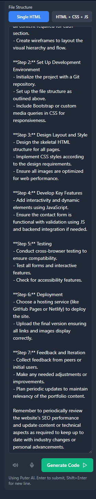
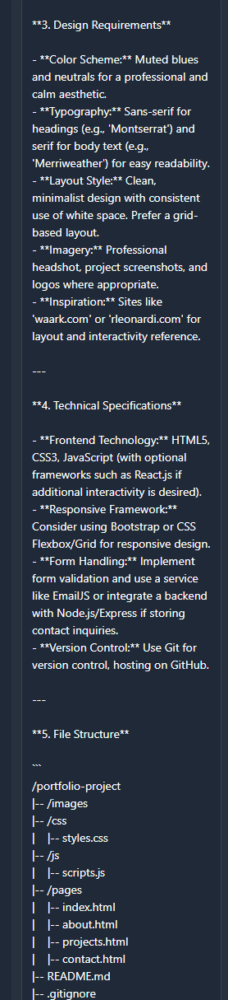
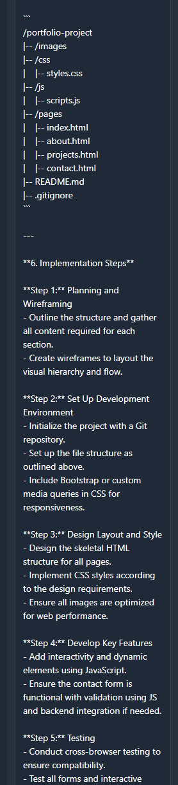
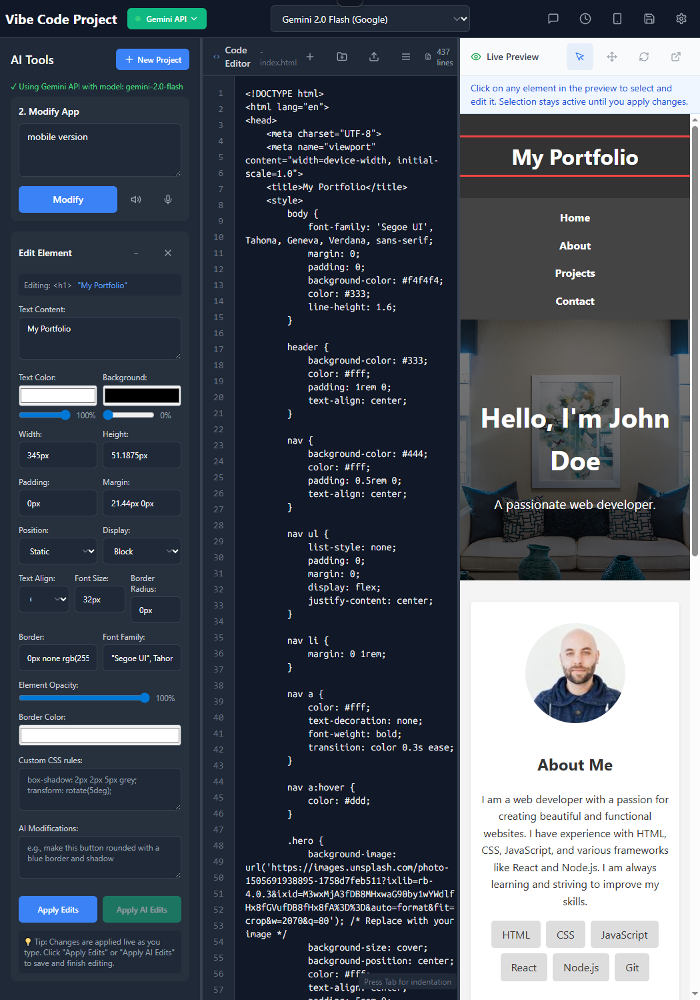
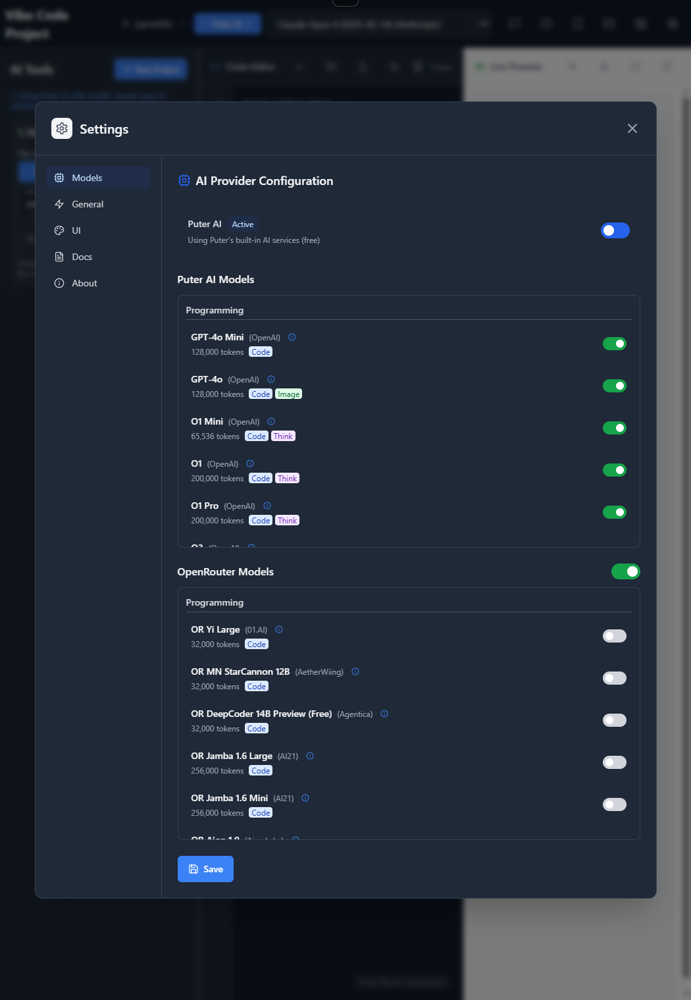
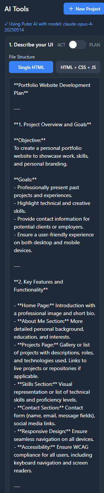
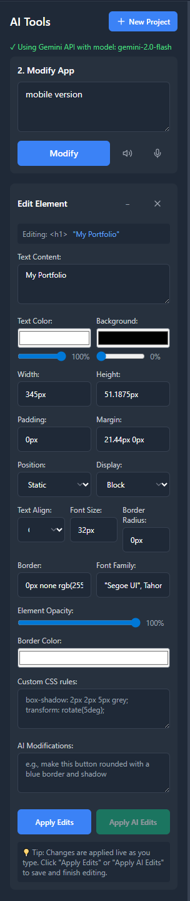
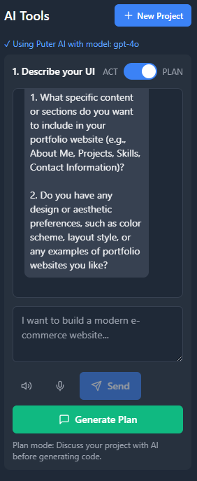
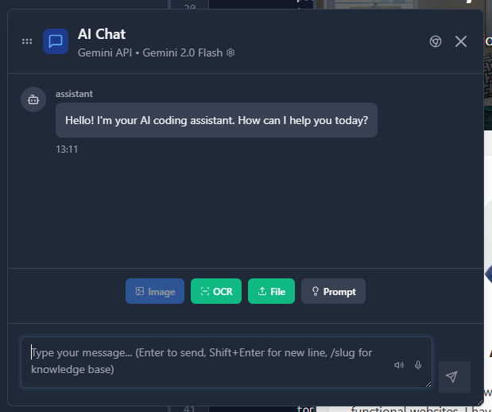
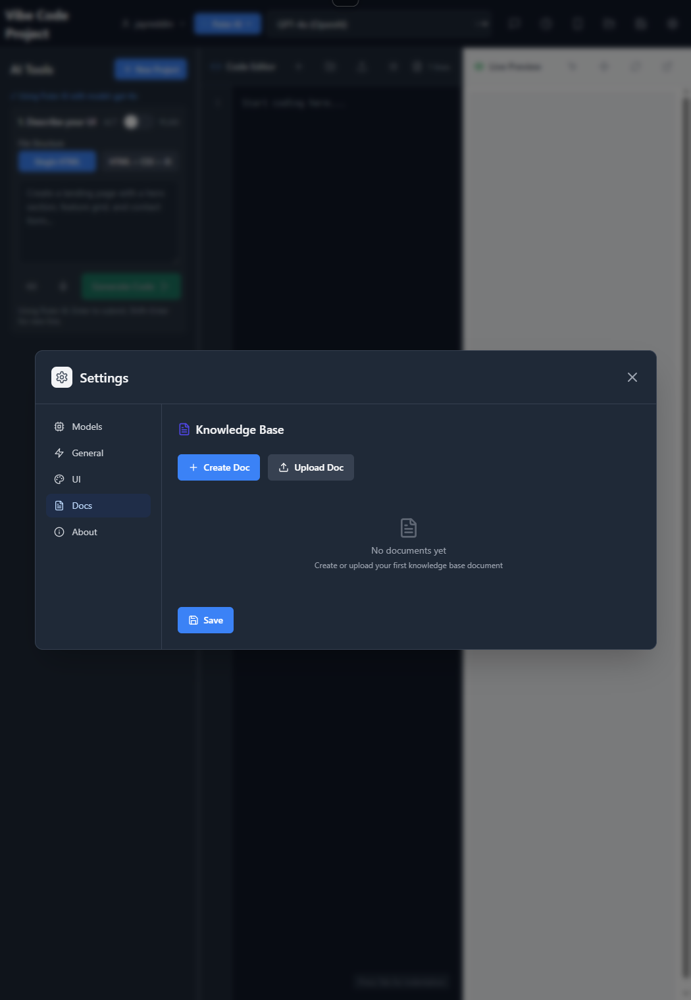

# AI Vibe Code

**Last Updated:** 2025-07-02 15:43:36 UTC  
**Maintainer:** [@JayjayR89](https://github.com/JayjayR89)

AI Vibe Code is an interactive AI-powered code project builder and editor designed for rapid prototyping, UI customization, and live previewing of web projects. It leverages advanced AI models (such as Puter AI and Gemini API) to assist users in creating, editing, and customizing web applications with ease.



## Table of Contents
- [Features](#features)
- [Getting Started](#getting-started)
- [Usage Guide](#usage-guide)
- [Advanced Features](#advanced-features)
- [Technical Requirements](#technical-requirements)
- [Contributing](#contributing)
- [License](#license)

## Features

### 1. AI-Assisted UI Planning and Generation
- **Conversational UI Design:** 
  - Natural language interface for project requirements
  - AI-powered code generation
  - Intuitive project planning
  

- **Content & Aesthetic Guidance:**
  - Smart content organization
  - Design preference specification
  - Automated structure suggestions
  

### 2. Project Templates & Creation
- **Project Wizard:**
  - Multiple template options:
    - Blank Project
    - Landing Page
    - Portfolio
    - Blog
    - Dashboard
    - Puter App
  

### 3. Development Environment
- **Interactive Code Editor**
  - Split-view interface
  - Real-time preview
  - Syntax highlighting
  

- **Visual Editor**
  - Element selection
  - Property controls
  - Live style editing
  

### 4. AI Integration
- **Multi-Provider Support**
  - Puter AI
  - Gemini API
  - Switchable AI models
  

- **AI-Driven Modifications**
  - Natural language commands
  - Automated styling
  - Layout optimization
  

## Getting Started

1. **Installation**
```bash
# Clone the repository
git clone https://github.com/JayjayR89/ai-vibe-code.git

# Navigate to project directory
cd ai-vibe-code

# Install dependencies
npm install

# Start the application
npm run dev
```

2. **Initial Setup**
   - Launch the application
   - Click "New Project"
   - Select a template
   - Name your project
   

## Usage Guide

### 1. Basic Workflow
1. **Start a New Project**
   - Choose template
   - Configure basic settings
   

2. **Development**
   - Use the code editor
   - Apply visual changes
   - Preview in real-time
   

3. **AI Assistance**
   - Enter natural language commands
   - Review suggestions
   - Apply changes
   

### 2. Advanced Features
- **Responsive Design Tools**
  - Mobile view testing
  - Breakpoint management
  

- **Custom CSS Management**
  - Style organization
  - Rule editor
  

## Technical Requirements
- Modern web browser
- Internet connection for AI features
- Minimum 4GB RAM recommended

## Keyboard Shortcuts
| Shortcut | Action |
|----------|--------|
| Ctrl+S | Save changes |
| Ctrl+P | Preview |
| Ctrl+Space | AI suggestions |
| Alt+← → | Switch panels |



## Full Feature List
- Conversational UI for requirements gathering
- Multiple project templates
- AI-powered code generation
- Real-time preview
- Visual property editor
- Custom CSS support
- AI-driven layout modifications
- Multiple AI provider support
- Code folder upload
- Responsive design support
- User-friendly navigation

## Contributing
Contributions are welcome! Please feel free to submit a Pull Request.

## License
[Add your license information here]

---

For questions or support, please [open an issue](https://github.com/JayjayR89/ai-vibe-code/issues) on GitHub.
